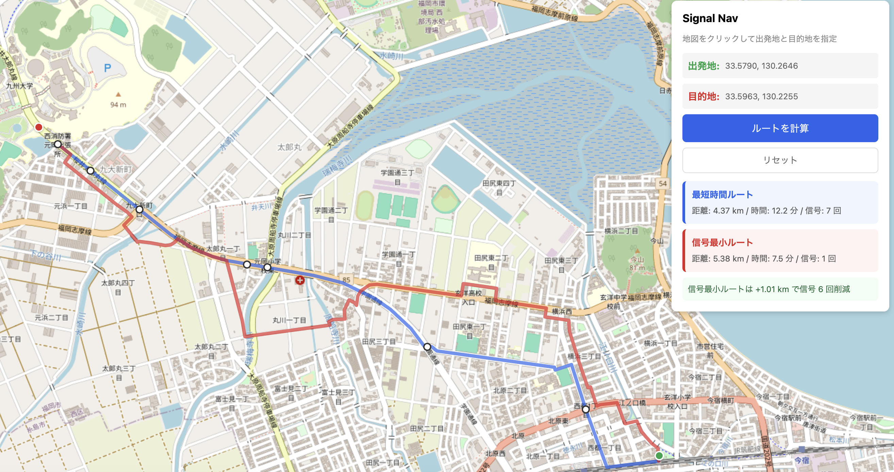

# Signal Nav - 信号最小化ルートナビ

信号機の通過回数を最小化するルートを提案するWebアプリケーション。通常の最短時間ルートと信号回避ルートを比較表示し、信号待ちを減らすことで実際の所要時間を短縮できるルートを見つける。



## 背景

カーナビの「最短ルート」は道路距離や所要時間を最適化するが、信号待ちの時間は考慮されていないことが多い。市街地では信号1回あたり平均30〜60秒の待ち時間が発生し、信号の多いルートと少ないルートで数分の差が出ることがある。本アプリは信号待ちを所要時間に組み込んだルート探索を行い、2つのルートを比較表示する。

## 機能

- 地図クリックで出発地・目的地を指定
- 2ルートの同時表示: 最短時間ルート（青）と信号最小ルート（赤）
- 距離・所要時間・信号通過数の比較
- ルート上の信号機を地図上にマーカー表示
- 道路形状に沿ったルート描画（OSMのgeometryデータを使用）

## 技術スタック

| レイヤー | 技術 | 用途 |
|---------|------|------|
| データソース | OpenStreetMap (via OSMnx) | 道路ネットワーク・信号機位置 |
| グラフ探索 | NetworkX (Dijkstra) | 重み付き最短経路探索 |
| 信号グループ化 | scipy KDTree + Union-Find | 近接信号ノードの同一交差点判定 |
| バックエンド | FastAPI + Uvicorn | REST API / 静的ファイル配信 |
| フロントエンド | Leaflet.js | 地図表示・ルート描画 |
| パッケージ管理 | uv | 依存関係管理・仮想環境 |

## アーキテクチャ

```
OSM データ → [build_graph] → NetworkX MultiDiGraph (メモリ上)
                                    │
                                    │  ノード属性: has_signal, signal_group
                                    │  エッジ属性: travel_time, travel_time_with_penalty
                                    │
ユーザー操作 → [Leaflet.js] → POST /api/route → [find_route]
                                    │
                                    │  nx.shortest_path × 2回
                                    │  ・weight="travel_time"（最短時間）
                                    │  ・weight="travel_time_with_penalty"（信号回避）
                                    │
                                    └→ JSON レスポンス → [Leaflet.js] → 地図に描画
```

### ルート探索のアルゴリズム

エッジの重みを「所要時間（秒）」に統一し、信号機のあるノードに到達するエッジに追加のペナルティ（デフォルト60秒）を加算する。同じグラフ上で2種類の重み属性を持つことで、1回のグラフ構築で2つのルートを計算できる。

### 信号グループ化

中央分離帯のある道路では、上り・下り車線に別々の信号ノードが存在する。これを個別にカウントすると1つの交差点で信号2回とされてしまう。KD木で30m以内の信号ノードペアを検出し、Union-Findで同一交差点としてグループ化することで正確なカウントを実現している。

## セットアップ

### 前提条件

- Python 3.12+
- [uv](https://docs.astral.sh/uv/)

### インストール・起動

```bash
git clone https://github.com/gontawara/signal-nav.git
cd signal-nav

# 依存関係のインストール
uv sync

# サーバー起動（初回はOSMデータのダウンロードに数分かかる）
uv run uvicorn signal_nav.api:app --reload
```

ブラウザで http://localhost:8000 を開く。

### テスト

```bash
uv run pytest tests/ -v
```

## プロジェクト構成

```
signal-nav/
├── src/signal_nav/
│   ├── routing.py          # ルーティングエンジン（グラフ構築・経路探索）
│   ├── api.py              # FastAPI サーバー
│   ├── demo.py             # 動作確認用スクリプト（folium地図生成）
│   └── validate_signals.py # データ検証スクリプト
├── static/
│   └── index.html          # フロントエンド（Leaflet.js）
├── tests/
│   └── test_routing.py     # ユニットテスト
├── data/                   # GraphMLキャッシュ（gitignore）
├── docs/decisions/         # ADR（Architecture Decision Records）
│   ├── 001_data_source.md
│   └── 002_routing_algorithm.md
└── pyproject.toml
```

## 技術的な判断の記録

主要な技術選定はADRとして `docs/decisions/` に記録している。

- **ADR-001**: データソースの選定（OSM vs 国土地理院 vs 警察データ等）
- **ADR-002**: ルーティングアルゴリズムの選定（OSRM vs Valhalla vs NetworkX）

## 既知の制限事項

- **対象エリア**: 福岡市のみ（OSMnxの`graph_from_place`で取得する範囲に依存）
- **速度の一律設定**: 全道路を50km/hとして計算。道路種別（高速道路・生活道路等）ごとの速度設定は未実装
- **信号ペナルティの固定値**: 信号1回あたり60秒で固定。実際の待ち時間は信号のサイクルや時間帯によって異なる
- **ターン制約の未考慮**: 右左折の信号待ちやUターン禁止は考慮していない
- **計算速度**: PythonのDijkstraを使用しているため、1リクエストあたり数秒かかる。大規模化にはOSRM等への移行が必要

## ライセンス

道路データは [OpenStreetMap](https://www.openstreetmap.org/) から取得しており、[ODbL](https://opendatacommons.org/licenses/odbl/) ライセンスに従う。
